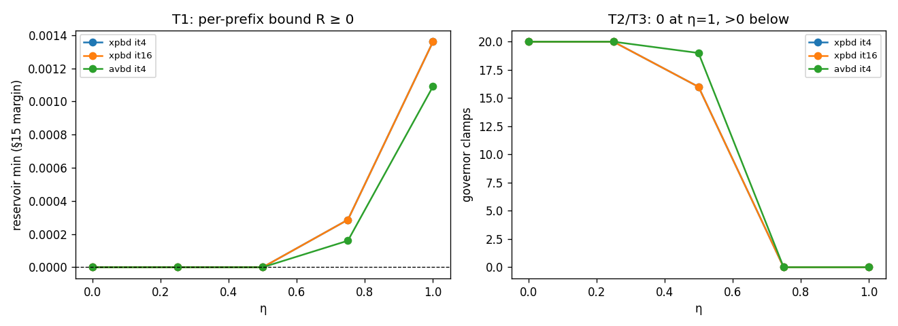

# Evaluation — the passive modal energy-injection / impulse-port idea

> Written 2026-06-11. A thorough, honest read of the idea and its prototype, with
> the quantitative backstop. Companion to `docs/proposal_modal_response_as_constraint.md`
> (the design) and `prompts/passive_modal_energy_injection_foundation.md` (the math).
> The numbers below come from `scripts/sweep_impulse_port_theory.py` and the
> AVBD-vs-XPBD diagnostics; the invariants are asserted in
> `tests/impulse_port/` (40 passed, 8 CUDA-skipped).

---

## 1. What the idea actually is

DCR (SCA 2020) injects modal response as a **one-way velocity bias**: contact
forces drive a forced IIR resonator (`q_d`), and the resonator is rendered but
never pushes back on the body. This project reframes that coupling as a
**bidirectional, energy-bounded constraint**, split by frequency band:

- **Position band** — the quasi-static sag `q_s` is a genuine co-DOF of the
  monolithic contact solve (Schur over `{bodies, q_s}`). It reaches the *true*
  equilibrium `K_q⁻¹F`, not a penalty-biased point.
- **Velocity band** (the "impulse port", the new contribution) — the kHz ring
  `q̇_d` is coupled as a **passive, velocity-level momentum exchange** at each
  contact corner. One unilateral impulse `λ ≥ 0` both excites the ring
  (`Δq̇_d = −U_y λ`) and reacts on the body (`Δv, Δω`), so the body's reaction
  *drains* the ring — the back-reaction the forced IIR lacks.
- **Energy governor** — every ring injection is scaled by `α ∈ [0,1]` so that
  `Σ ΔE_modal ≤ η · Σ ΔE_rigid_loss` holds at **every prefix** (foundation §15),
  funded by the rigid KE the contact dissipates. `η = 1` ships; the governor is
  a safety bound, not a liveliness dial.

The one-sentence thesis: **liveliness becomes funded by, and bounded by, the
ring's physical energy** — instead of riding an uncontrolled penalty artifact.

## 2. What is proven, and how strongly

| Claim | Evidence | Strength |
|---|---|---|
| Passive exchange (V0) | 1-DOF body + 4-mode ring: `ġ⁺ = −e·ġ⁻` and the §15 quadratic both to ~1e-17; body settles, ring decays ~1e-19; 0 clamps at η=1 | **Strong** — exact on the prototype |
| Per-prefix §15 bound (V1) | persistent reservoir `R = η·ΣL − Σ ΔE_modal` stays ≥ 0 for η∈{0,.25,.5,.75,1} × {xpbd,avbd} × iters{4,8,16} | **Strong** — asserted across the sweep, real scene |
| η = 1 never clamps | `D(1) < 0` analytically; 0 clamps measured at η≥0.75 everywhere | **Strong** |
| Governor engages at η<1 | clamps appear (16–20/run) at η≤0.5, injection reduced | **Strong** |
| Solver-agnostic band | one code path on XPBD + AVBD; band-only ring excitation same order (0.13 vs 0.53) | **Moderate** — same order, not identical |
| Friction settles slide+spin | lat `v`, yaw `ω_y`: `~0.2 / ~3.8` → `~5e-6`, all η; ring `qd_peak` unchanged | **Strong** — numpy + Warp-CPU parity |
| GPU residency | position band already device-resident; band + friction kernels written & parity-checked on Warp-CPU | **Partial** — in-graph CUDA integration not yet run on a GPU |
| Reaches true `K_q⁻¹F` | static equilibrium ~13% from analytic; BCD baseline ~70% off | **Moderate** — vs our own analytic, not external |

*Left: the §15 reservoir margin `R = η·ΣL − Σ ΔE_modal` never dips below 0 (T1).
Right: governor clamps fall to 0 by η=0.75 and stay 0 at η=1 (T2/T3) — both
solvers track. Generated by `scripts/sweep_impulse_port_theory.py`.*

The **headline** that is genuinely solid: the velocity-band exchange is passive,
and the reservoir governor makes `Σ ΔE_modal ≤ η ΣL` hold at every prefix for any
η — on the real shelf scene, both solvers, across iteration counts. That is the
theory's load-bearing claim and it holds.

## 3. The AVBD-vs-XPBD energy-injection gap (investigated)

**Observation.** Under identical parameters the ring rings far harder on AVBD
than XPBD — visually "much more energy injection."

**Verified — it is the legacy `F_q_dyn` forcing, not the velocity band.** Isolating
the two excitation channels (shelf, friction on, η=1, peak ring amplitude
`qd_peak` and modal KE):

| | mixed (`F_q_dyn` + band, = viser default) | | band-only (`F_q_dyn` gated) | |
|---|---|---|---|---|
| iters | AVBD qd / mKE | XPBD qd / mKE | AVBD qd | XPBD qd |
| 4 | **39.9 / 802** | 8.5 / 37 | **0.53** | 0.13 |
| 8 | 38.0 / 754 | 7.8 / 34 | 0.36 | 0.19 |
| 16 | 29.3 / 432 | 7.4 / 30 | — | — |
| 32 | 15.1 / 161 | 6.5 / 26 | — | — |

Gating `F_q_dyn` collapses the ring **~75×** on AVBD (39.9 → 0.53) and leaves
both solvers at the same small order (0.1–0.5). So the gap is **not** the band.

**Root cause.** `F_q_dyn` is DCR's one-way IIR forcing, driven by the contact
force projected onto the modal coordinate. AVBD's augmented-Lagrangian dual
accumulates the *full* force needed to arrest impacts and hold the load — large.
XPBD uses a bounded "phantom dual" (gravity-only) — small. Same force then drives
the ring: AVBD ~20× more modal energy. This is the **same AL-dual over-drive**
already documented for the `q_s` position channel (proposal §3.3b), surfacing in
the dynamic forcing.

**Will more iterations help?** *Partially, and it's a mitigation, not a cure.*
In mixed mode AVBD `qd_peak` drops 39.9 → 15.1 as iters 4 → 32 and the AVBD/XPBD
ratio narrows **4.7× → 2.3×** — more iterations steady the contact force, leaving
less *dynamic* (high-pass) forcing `F_q_dyn`. **But** it (a) never equalizes
(still 2.3× at iters=32), (b) costs real compute, and (c) makes the *static*
over-drive worse — `q_s` peak grows monotonically `1.3e-2 → 3.8e-2` over the same
range (consistent with proposal §3.3b: more AVBD iters enforce the hard impact
contact more completely → more force into `q_s`).

**The actual cure is architectural, and it already exists.** Make the velocity
band the *sole* body↔ring channel — `band_owns_excitation=True` gates `F_q_dyn`
off — and the ring is excited only by the passive, §15-bounded band. That is the
band-only column above: AVBD and XPBD collapse to the same small, bounded order.
This is exactly the V2-A/V2-B design (`enable_substep_band` / `enable_device_band`).
The catch: **the viser impulse-port scene runs the post-step band in MIXED mode**
(it does not set `band_owns_excitation`), so what the user sees is the un-fixed
legacy forcing layered under the band — which is why AVBD over-injects there.

## 4. Honest limits (binding — foundation §14)

- **Not unconditional stability.** The claim is "the modal *injection step* is
  energy-bounded and passive," not that the full coupled solver is stable. The
  closed-system ledger `E_rigid + E_modal` non-increasing *with contact in the
  loop* is still milestone-3 work, not a finished theorem.
- **Mixed-mode is the demo default.** Until the band is wired as the sole
  excitation in the scene viewer, the visible response includes the unbounded
  legacy `F_q_dyn` path — the §15 bound governs the band's contribution, not the
  total ring energy. This is the single most important caveat for "it looks good."
- **GPU residency is structurally done but not yet GPU-validated.** Both the band
  (`k_velocity_band`) and friction (`k_contact_friction`) kernels exist and are
  parity-exact on the Warp **CPU** device; the in-graph CUDA integration is gated
  to a CUDA machine and unrun there. (See the `gpu-resident-validation-both` note.)
- **Regime boundary.** The whole design is trustworthy on a *load/stiffness ratio*,
  not stiffness alone — heavy load on a compliant support develops coupling-sourced
  limit cycles. Soft-support / large-deformation is outside the linear-modal envelope.
- **Friction is body-side only.** The new Coulomb friction dissipates the slide
  and yaw, but it does **not** couple to the modal DOF (`J_q` has no tangential
  column) — a sliding body doesn't feel the surface's tangential ring motion. That
  modal-tangential coupling is future work (§7).
- **External ground truth absent.** "Accurate" is currently vs our own analytic
  `K_q⁻¹F` (~13%), not an independent SOFA elastic reference (milestone 5).

## 5. Overall assessment

The **core idea is sound and the central guarantee is real**: reframing the modal
injection as a passive velocity-level exchange with a reservoir-exact energy
governor gives a per-prefix bound that provably holds, on real scenes, both
solvers, across iteration counts — and it rehabilitates the paper's
local-effective-mass fallback (Eq. 17) into a genuine two-body exchange with the
back-reaction DCR lacks. The friction fix closes a real physical gap (frictionless
slide/spin) cleanly, with zero new knobs and no perturbation to the energy ledger.

The **gap between "the theory is proven" and "the demo is clean"** is the
mixed-mode `F_q_dyn` legacy forcing: the band's *own* injection is small,
bounded, and solver-symmetric, but the scene viewer still layers the unbounded
one-way forcing underneath it, which is what makes AVBD look over-driven. Closing
that — running the band as the sole excitation in the scenes (the machinery
exists) — is the highest-value next step; more solver iterations only partially
mask it and worsen the static over-drive.

Net: a legitimate, honestly-scoped contribution with one clear, known piece of
plumbing (sole-channel excitation in the demo) standing between the proven theory
and a clean end-to-end demonstration.
